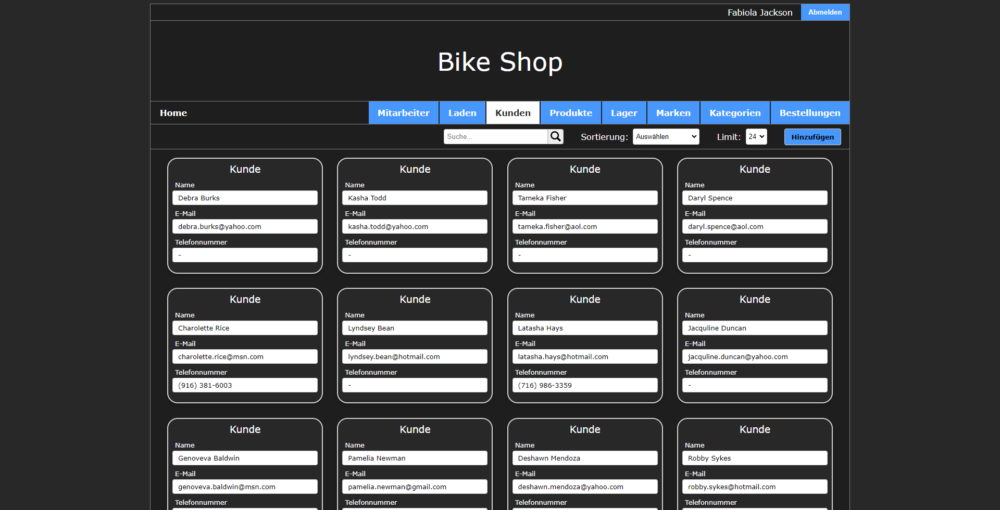
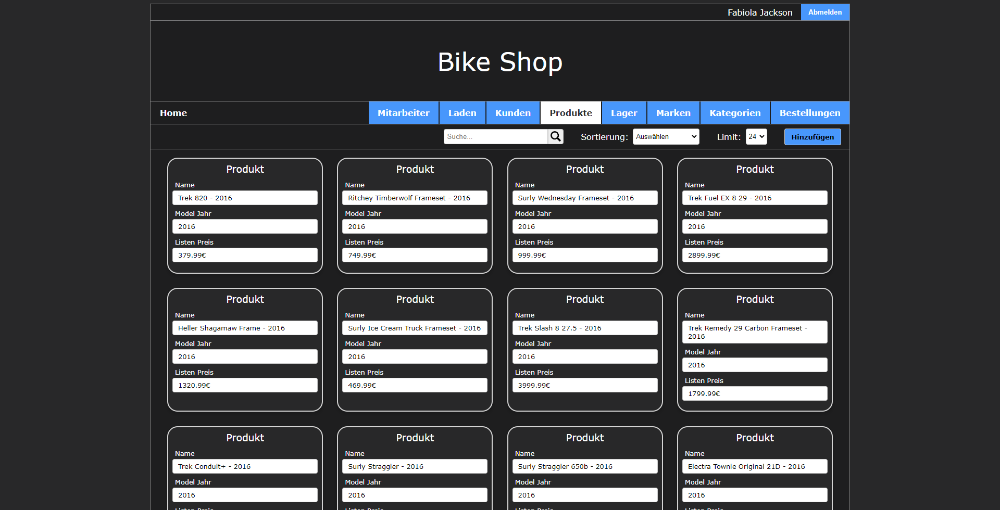

# Bike Store

## Table of contents

-   [Overview](#overview)
-   [External dependencies](#external-dependencies)
-   [Build](#build)
-   [Login](#login)
-   [Tests](#tests)
-   [Features](#features)
-   [Screenshots](#screenshots)

## Overview

This project aims to implement a bike shop website. It's building a .war file, deployable on a wildfly webserver.<br>
The website lets users access the bike shop and its PostgreSQL database.
This was a project for university of my software engineering course.

## External dependencies

| Name         | Version | Link                                                                |
| ------------ | ------- | ------------------------------------------------------------------- |
| Java JDK     | 19      | https://jdk.java.net/19/                                            |
| Wildfly      | 28      | https://www.wildfly.org/                                            |
| PostgreSQL   | 15.3    | https://www.postgresql.org/                                         |
| JBDC Driver  | 42.6.0  | https://mvnrepository.com/artifact/org.postgresql/postgresql/42.6.0 |

## Build

To build this project, clone this repository and install the external dependencies.<br>
First import the file `bike-store.sql` into your PostgreSQL database. The File is located in `docs`.<br>

You have to create a wildfly user with the add-user.bat or add-user.sh script in the bin folder of your wildfly installation.<br>

And you have to configure the wildfly server with the following commands:

```
/subsystem=elytron/policy=jacc:add(jacc-policy={})
```

```
/subsystem=undertow/application-security-domain=other :write-attribute(name=integrated-jaspi, value=false)
```

To do this you have to start the wildfly server with `standalone.bat` for windows or `standalone.sh` for linux in `bin/`.<br>
Now you start the jboss-cli.bat or jboss-cli.sh script in the bin folder of your wildfly installation.<br>
Type `connect` to connect to the server and paste the commands above. Now your wildfly is ready.<br>

To build this project, clone this repository and execute:

```
mvn clean package -DskipTests
```

The JBDC Driver has to be into `standalone/deployments` in your wildfly installation.
This creates a `bike-store.war` file, which has to be copied to your
wildfly 28 installation into `standalone/deployments` in your wildfly
installation.<br>Start the wildfly server with `standalone.bat` for windows
or `standalone.sh` for linux in `bin/`.

## Login

These are the credentials for the admin account:

| Name                       | Password |
| -------------------------- | -------- |
| fabiola.jackson@bikes.shop | 555-5554 |

## Tests

To run the tests, you have to install the external dependencies and configure the wildfly server as described above. The wildfly server has to be running with a bike-store.war file deployed. In complete the tests are running for 6 minutes.<br>

To run the tests, execute:
```
mvn clean package
```

There are a total of 102 tests, divided into:
- 14 in BrandTest.java
- 14 in CategoryTest.java
- 16 in CustomerTest.java
- 14 in OrderTest.java
- 16 in ProductTest.java
- 9 in StaffTest.java
- 16 in StoreTest.java
- 3 in UserTest.java

## Features

-   User Authentication
-   CRUD operations for all entities
-   Pagination for all pages
-   Search for Entities
-   Sorting for Entities
-   Responsive and mobile friendly design
-   Tests for all CRUD operations

## Screenshots

### Login

<div id="image-table">
    <table>
	    <tr>
    	    <td style="padding:10px">
        	    
      	    </td>
            <td style="padding:10px">
            	
            </td>
        </tr>
        <tr>
    	    <td style="padding:10px">
        	    
      	    </td>
            <td style="padding:10px">
            	
            </td>
        </tr>
        <tr>
    	    <td style="padding:10px">
        	    
      	    </td>
            <td style="padding:10px">
            	
            </td>
        </tr>
        <tr>
    	    <td style="padding:10px">
        	    
      	    </td>
            <td style="padding:10px">
            	
            </td>
        </tr>
        <tr>
    	    <td style="padding:10px">
        	    
      	    </td>
            <td style="padding:10px">
            	
            </td>
        </tr>
        <tr>
    	    <td style="padding:10px">
        	    
      	    </td>
            <td style="padding:10px">
            	
            </td>
        </tr>
        <tr>
    	    <td style="padding:10px">
        	    
      	    </td>
            <td style="padding:10px">
            	
            </td>
        </tr>
    </table>
</div>